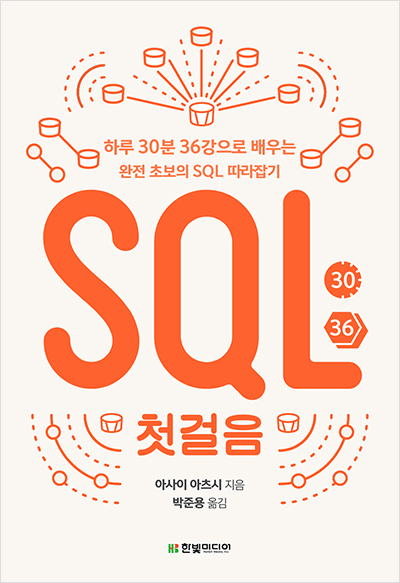

## SQL 첫걸음

### Contents
- Chapter01 데이터베이스와 SQL
- Chapter02 테이블에서 데이터 검색
- Chapter03 정렬과 연산
- Chapter04 데이터의 추가, 삭제, 갱신
- Chapter05 집계와 서브쿼리
- Chapter06 데이터베이스 객체 작성과 삭제
- Chapter07 복수의 테이블 다루기
- Chapter08 데이터베이스 설계

---

### SQL사용 환경 : MYSQL Workbench
- 설치 완료후에 Edit > Preferences > Sql Editor 에 접속후에 "Safe Updates ~" 체크를 해제하고 다시 프로그램을 실행해야 DELETE나 UPDATE등이 잘 작동합니다.
